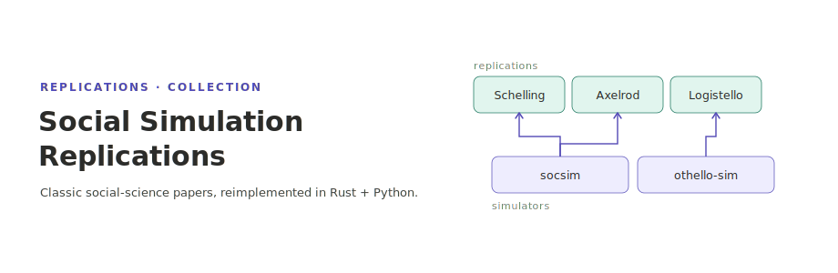

<p align="center"></p>

[English](README.md) | **日本語**

# Social Simulation Replications

社会科学系の古典的論文のシミュレーションを再現実装するプロジェクト集．各実装は独立したリポジトリとして Git Submodule で管理しています．

## Replications

<!-- BEGIN:replications (auto-generated by tools/gen_catalog.py — edit replications.toml then re-run) -->

全 19 件の再現実装を 3 カテゴリに分類しています．完全なカタログは [docs/replications.ja.md](docs/replications.ja.md) を参照してください．

### 古典的エージェントベースモデル

| 年 | 論文 | テーマ | リポジトリ |
|----|------|--------|------------|
| 1971 | Schelling, "Dynamic Models of Segregation" | 住み分け（分居） | [schelling1971](https://github.com/akitenkrad/schelling1971) |
| 1973 | Granovetter, "The Strength of Weak Ties" | 弱い紐帯・ネットワーク | [granovetter1973](https://github.com/akitenkrad/granovetter1973) |
| 1997 | Axelrod, "The Dissemination of Culture" | 文化の伝播 | [axelrod1997](https://github.com/akitenkrad/axelrod1997) |
| 2002 | Hegselmann & Krause, "Opinion Dynamics and Bounded Confidence: Models, Analysis and Simulation" | 限定信頼モデル | [hegselmann2002](https://github.com/akitenkrad/hegselmann2002) |
| 2005 | Hegselmann & Krause, "Opinion Dynamics Driven by Various Ways of Averaging" | 意見ダイナミクス (平均演算子) | [hegselmann2005](https://github.com/akitenkrad/hegselmann2005) |

### LLM ベースの社会シミュレーション

#### 意見・規範・集合行動

| 年 | 論文 | テーマ | リポジトリ |
|----|------|--------|------------|
| 2013 | Knoll & van Dick, "Do I Hear the Whistle…? A First Attempt to Measure Four Forms of Employee Silence and Their Correlates" | 従業員サイレンス (4 動機形態) | [knoll2013](https://github.com/akitenkrad/knoll2013) |
| 2013 | Brinsfield, "Employee Silence Motives: Investigation of Dimensionality and Development of Measures" | 従業員サイレンス (6 動機次元) | [brinsfield2013](https://github.com/akitenkrad/brinsfield2013) |
| 2024 | Chuang et al., "Simulating Opinion Dynamics with Networks of LLM-based Agents" | 意見ダイナミクス | [chuang2024](https://github.com/akitenkrad/chuang2024) |
| 2024 | Ren et al., "Emergence of Social Norms in Generative Agent Societies (CRSEC)" | 社会規範 | [ren2024](https://github.com/akitenkrad/ren2024) |
| 2024 | Mou et al., "Unveiling the Truth and Facilitating Change: Towards Agent-based Large-scale Social Movement Simulation (HiSim)" | 社会運動 | [mou2024](https://github.com/akitenkrad/mou2024) |

#### 経済・市場・資源

| 年 | 論文 | テーマ | リポジトリ |
|----|------|--------|------------|
| 2023 | Han et al., "Guinea Pig Trials Utilizing GPT: A Smart Agent-Based Modeling Approach for Studying Firm Competition and Collusion (SABM)" | 企業間競争・共謀 | [han2023](https://github.com/akitenkrad/han2023) |
| 2024 | Li et al., "EconAgent: LLM-Empowered Agents for Simulating Macroeconomic Activities" | マクロ経済 | [li2024](https://github.com/akitenkrad/li2024) |
| 2024 | Ji et al., "SRAP-Agent: Simulating and Optimizing Scarce Resource Allocation Policy with LLM-based Agent" | 資源配分 | [ji2024](https://github.com/akitenkrad/ji2024) |

#### 競争・紛争

| 年 | 論文 | テーマ | リポジトリ |
|----|------|--------|------------|
| 2024 | Zhao et al., "CompeteAI: Understanding the Competition Dynamics of LLM-based Agents" | 競争 | [zhao2024](https://github.com/akitenkrad/zhao2024) |
| 2024 | Hua et al., "War and Peace (WarAgent): LLM-based Multi-Agent Simulation of World Wars" | 国際紛争 | [hua2024](https://github.com/akitenkrad/hua2024) |

#### 基盤・大規模シミュレータ

| 年 | 論文 | テーマ | リポジトリ |
|----|------|--------|------------|
| 2023 | Gao et al., "S3: Social-network Simulation System with LLM-Empowered Agents" | ソーシャルネットワーク基盤 | [gao2023](https://github.com/akitenkrad/gao2023) |
| 2024 | Yang et al., "OASIS: Open Agent Social Interaction Simulations with One Million Agents" | 大規模シミュレーション基盤 | [yang2024](https://github.com/akitenkrad/yang2024) |
| 2025 | Wang et al., "YuLan-OneSim: Towards the Next Generation of Social Simulator with Large Language Models" | シミュレータ基盤 | [wang2025](https://github.com/akitenkrad/wang2025) |

### ゲーム AI・その他

| 年 | 論文 | テーマ | リポジトリ |
|----|------|--------|------------|
| 1994–1999 | Buro, "Logistello (7 papers)" | オセロのゲーム AI | [logistello](https://github.com/akitenkrad/rs-logistello) |

<!-- END:replications -->

## Simulators

汎用シミュレータコンポーネント．特定の論文の再現ではなく，再現実験や強化学習研究の基盤として横断的に使えるフレームワークを `simulators/` 配下に配置しています．

| 名称 | ディレクトリ |
|------|-------------|
| rs-social-simulation-tools | [simulators/rs-social-simulation-tools](https://github.com/akitenkrad/rs-social-simulation-tools) |
| rs-othello-sim | [simulators/rs-othello-sim](https://github.com/akitenkrad/rs-othello-sim) |

## Getting Started

```bash
# Submodule を含めてクローン
git clone --recurse-submodules git@github.com:akitenkrad/social-simulation-replications.git

# 既にクローン済みの場合は Submodule を取得
git submodule update --init --recursive
```

各実装の詳細な実行方法は，それぞれのディレクトリ内の README を参照してください．

## Documentation

- [Adding a Replication](docs/adding-a-replication.ja.md) — テンプレートから新規 Replication を作成する方法．

## License

MIT
